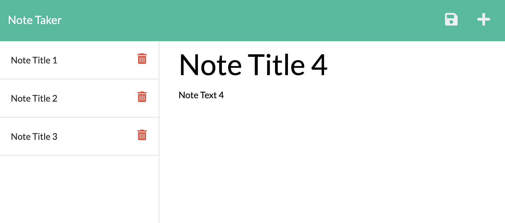

# Challenge 11 Note Taker

## Project Purpose

A note taking website complete with add / delete functionality.

## Page Built With

- Bootstrap CSS
- JavaScript ES6 / ES2015
- Express.js
- UUID (npm package)

## Usage

Visit https://peaceful-river-13392.herokuapp.com/ and click on Get Started. Type in a new note (both title and text are required), and the Save icon will show up in the upper-right hand corner. Click the Save icon to add the note to your list. Clicking on an existing note in the left-hand column will display the full title and full contents of the selected note. While viewing an existing note, you can click the Plus icon in the upper-right hand corner to start with a fresh note. Use the red Trash icon on the left-hand column to delete an individual note.

## Contributors

Made with ❤️ by Joe Gallina (backend) and Trilogy Education Services (frontend)
